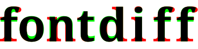

# 

## Overview
fontdiff is a tool to visually compare differences between two fonts by
displaying character atlases overlaid.

## Usage Example
```
fontdiff fontA.ttf fontB.ttf
# you can use some predefined chars set
fontdiff fontA.ttf fontB.ttf +greek +numerals
# or even try more options
fontdiff --cell-size 30 --chars "abcde1234!@#$" fontA.ttf fontB.ttf
# save result as file
fontdiff fontA.ttf fontB.ttf > diff.png
```

## Dependencies
- python ≥3.10
- pillow
- numpy (optional)

## Miscellaneous
You can configure fontdiff by putting a toml `config` file into
`$XDG_CONFIG_HOME/fontdiff/` or `$HOME/.fontdiff/` directory. An example
configuration file is provided in this repository. It's worth taking a look if
you need additional functionality like character sets, size or color settings.
